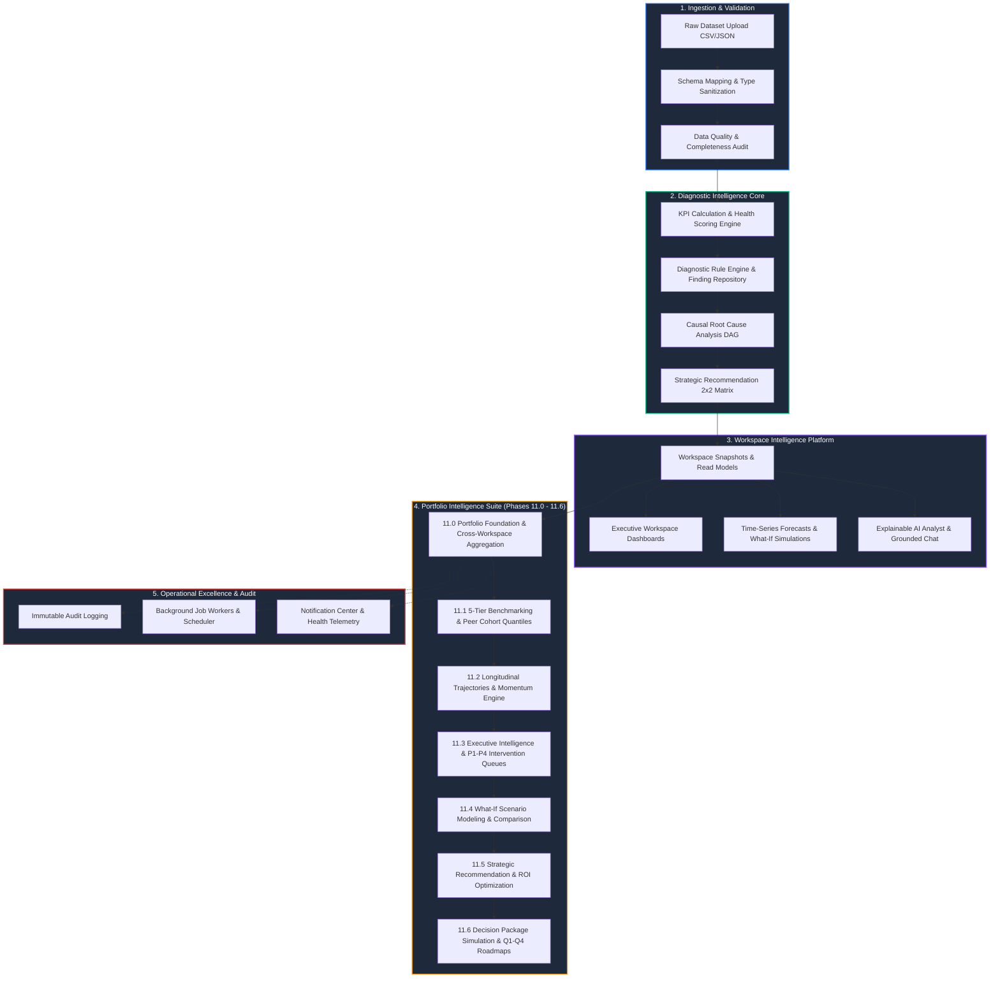
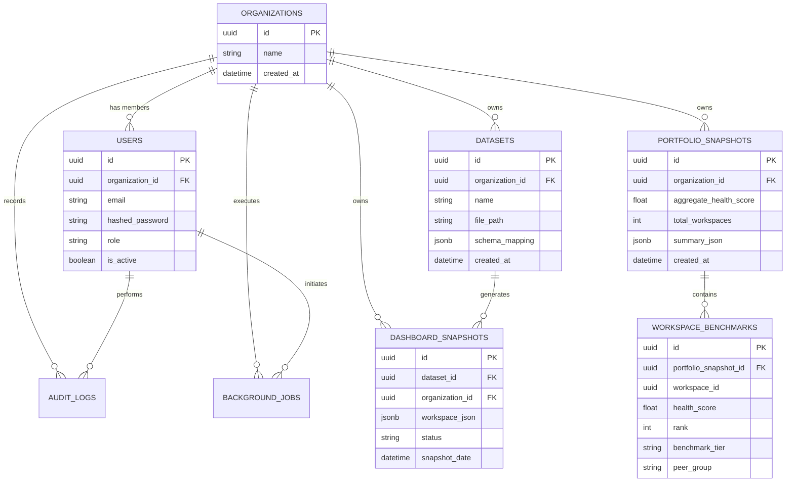

# 🧠 DecisionOS

> **Enterprise-Grade Explainable AI Business Intelligence, Portfolio Analytics, and Executive Decision Intelligence Platform**  
> *Transforming multi-domain operational data into deterministic KPIs, diagnostic findings, causal root-cause chains, what-if scenario simulations, portfolio benchmarks, executive risk intelligence, strategic recommendations, and multi-quarter execution roadmaps.*

---

<p align="center">
  
  
  
  
  
  
  
  
  
  
  
</p>

---

# 📑 Table of Contents

- [1. Executive Overview](#1-executive-overview)
- [2. Architecture Highlights](#2-architecture-highlights)
- [3. End-to-End System Pipeline DAG](#3-end-to-end-system-pipeline-dag)
- [4. Portfolio Intelligence Suite (Phases 11.0 – 11.6)](#4-portfolio-intelligence-suite-phases-110--116)
- [5. Core Platform Intelligence Engines](#5-core-platform-intelligence-engines)
- [6. Technical & System Architecture](#6-technical--system-architecture)
- [7. Repository Structure](#7-repository-structure)
- [8. Database Architecture & Provenance Chain](#8-database-architecture--provenance-chain)
- [9. REST API Reference](#9-rest-api-reference)
- [10. Enterprise Security & Multi-Tenancy](#10-enterprise-security--multi-tenancy)
- [11. Testing & Quality Verification](#11-testing--quality-verification)
- [12. Why DecisionOS is Different](#12-why-decisionos-is-different)
- [13. Why Recruiters Notice This Project](#13-why-recruiters-notice-this-project)
- [14. Why DecisionOS Stands Out (Engineering Showcase)](#14-why-decisionos-stands-out-engineering-showcase)
- [15. System Scale](#15-system-scale)
- [16. Product Roadmap](#16-product-roadmap)
- [17. Installation & Quickstart Guide](#17-installation--quickstart-guide)

---

# 1. Executive Overview

### The Problem
Modern enterprise leadership faces an acute intelligence paradox: organizations produce vast amounts of operational data, yet executive decision-making remains trapped between **superficial CRUD dashboards** that only show *what happened*, **generic BI tools** requiring army of analysts to interpret, and **unreliable "black-box" AI predictions** that hallucinate without mathematical auditability. Leadership lacks answers to fundamental strategic questions:
- *Why did a specific business unit experience performance degradation?*
- *Where is operational risk concentrated across the multi-unit portfolio?*
- *Which peer cohorts are driving gains versus dragging down collective health?*
- *If leadership executes strategic intervention A, B, or C, what mathematical outcome and quarterly roadmap should be committed?*

### The Solution: DecisionOS
**DecisionOS** is an enterprise-grade business intelligence and executive decision engine. Built from the ground up on principles of **mathematical determinism, causal explainability, and multi-tenant isolation**, DecisionOS converts raw transactional datasets into a full strategic decision pipeline:

$$\text{Raw Data} \longrightarrow \text{KPIs} \longrightarrow \text{Diagnostics} \longrightarrow \text{Causal DAG} \longrightarrow \text{Portfolio Benchmarks} \longrightarrow \text{Scenario Simulations} \longrightarrow \text{Strategic Roadmaps}$$

Every metric, risk concentration index, cohort migration matrix, scenario projection, and quarterly initiative is generated deterministically—with full cryptographic snapshot provenance—guaranteeing that board briefings and executive decisions are 100% reproducible and auditable.

---

# 2. Architecture Highlights

```
✓ Deterministic KPI & Aggregation Engine (100% Explainable Math)
✓ Causal Root-Cause Analysis DAG (Multi-Stage Diagnostic Tracing)
✓ Cross-Workspace Portfolio Benchmarking (5-Tier Cohorts & Dense Ranking)
✓ Longitudinal Trajectories & Normalized Momentum (Multi-Window Velocities)
✓ Executive Decision Center (P1–P4 Priority Intervention Queues)
✓ Ephemeral What-If Scenario Simulations (Clamped Score Projections)
✓ Strategic Recommendation & ROI Optimization (4-Factor Sorting Policy)
✓ Executive Decision Simulation & Multi-Quarter Roadmaps (Q1–Q4 Horizons)
✓ Explainable AI Narrative Synthesis (Grounded Strictly on Telemetry)
✓ Production-Grade Operational Platform (Background Workers, Audit, Alerts)
✓ Strict Multi-Tenant SaaS Isolation & RBAC (Admin, Analyst, Viewer)
```

---

# 3. End-to-End System Pipeline DAG

The diagram below illustrates the comprehensive intelligence data flow through DecisionOS:



---

# 4. Portfolio Intelligence Suite (Phases 11.0 – 11.6)

The Portfolio Intelligence Layer represents the apex of DecisionOS, scaling intelligence from single datasets to multi-workspace enterprise portfolios.

### Visual Maturity Progression

```
┌────────────────────────────────────────────────────────────────────────┐
│ 11.0 Portfolio Foundation                                             │
│      Cross-workspace aggregation, percentiles, leaderboard ranking     │
└───────────────────────────────────┬────────────────────────────────────┘
                                    │
                                    ▼
┌────────────────────────────────────────────────────────────────────────┐
│ 11.1 Benchmarking & Peer Groups                                        │
│      5 Executive Tiers, 5 Peer Cohorts, linear interpolation quantiles │
└───────────────────────────────────┬────────────────────────────────────┘
                                    │
                                    ▼
┌────────────────────────────────────────────────────────────────────────┐
│ 11.2 Longitudinal Trends & Momentum                                    │
│      Multi-window trajectories (7-365d), transition matrix, momentum   │
└───────────────────────────────────┬────────────────────────────────────┘
                                    │
                                    ▼
┌────────────────────────────────────────────────────────────────────────┐
│ 11.3 Executive Decision Center                                         │
│      P1–P4 intervention queues, risk concentration, board briefings    │
└───────────────────────────────────┬────────────────────────────────────┘
                                    │
                                    ▼
┌────────────────────────────────────────────────────────────────────────┐
│ 11.4 Scenario Modeling & Strategic Planning                            │
│      In-memory what-if simulations, dense re-ranking, multi-comparison │
└───────────────────────────────────┬────────────────────────────────────┘
                                    │
                                    ▼
┌────────────────────────────────────────────────────────────────────────┐
│ 11.5 Strategic Recommendations & Optimization                          │
│      Opportunity detection, ROI scoring (Impact/Effort), 4-factor sort │
└───────────────────────────────────┬────────────────────────────────────┘
                                    │
                                    ▼
┌────────────────────────────────────────────────────────────────────────┐
│ 11.6 Executive Decision Simulation & Strategic Roadmaps                │
│      Strategic initiatives, Options A/B/C simulation, Q1–Q4 roadmaps   │
└────────────────────────────────────────────────────────────────────────┘
```

---

### Phase Breakdown & Technical Specifications

#### Phase 11.0: Portfolio Intelligence Foundation
- **Persistence & Aggregation Engine**: Computes cross-workspace averages, variance, median, min/max, and percentile rankings ($0.0 \dots 100.0$).
- **Portfolio Snapshots**: Persistent point-in-time state capturing total workspaces, aggregate health, and leaderboard standings.
- **REST Endpoints**: `/portfolio/summary`, `/portfolio/workspaces`, `/portfolio/ranking`, `/portfolio/health`, `/portfolio/compare`.

#### Phase 11.1: Portfolio Benchmarking & Peer Group Intelligence
- **5 Executive Benchmark Tiers**: `ELITE` ($\ge 90$), `STRONG` ($80 \dots 89.9$), `STABLE` ($70 \dots 79.9$), `AT_RISK` ($60 \dots 69.9$), `CRITICAL` ($< 60$).
- **5 Peer Group Cohorts**: `TOP_PERFORMERS`, `HIGH_PERFORMERS`, `MID_PERFORMERS`, `UNDERPERFORMERS`, `CRITICAL_ATTENTION`.
- **Mathematical Quantiles**: Linear interpolation quantiles ($p_{25}, p_{50}, p_{75}, p_{90}$) and distribution analysis.
- **REST Endpoints**: `/portfolio/benchmark`, `/portfolio/benchmarks`, `/portfolio/peer-groups`, `/portfolio/distribution`, `/portfolio/insights`, `/portfolio/peer-comparison`.

#### Phase 11.2: Portfolio Trends & Strategic Performance Intelligence
- **Multi-Window Longitudinal Analysis**: 7, 30, 90, 180, and 365-day rolling analytical windows.
- **Cohort Transition Matrix**: Tracks migrations between peer groups across historical snapshots (`UPGRADE`, `DOWNGRADE`, `UNCHANGED`).
- **Normalized Momentum Engine**: Computes directional velocity index ($-100.0 \dots +100.0$) factoring score delta, acceleration, and transition weight.
- **REST Endpoints**: `/portfolio/trends`, `/portfolio/workspaces/{id}/trends`, `/portfolio/cohort-migrations`, `/portfolio/momentum`, `/portfolio/strategic-insights`.

#### Phase 11.3: Executive Portfolio Intelligence & Strategic Decision Center
- **P1–P4 Priority Intervention Queues**:
  - `P1` (Immediate Intervention, $<60.0$ Health or Active Critical Findings)
  - `P2` (High Priority Risk, Deteriorating Trajectory $\le -5.0$)
  - `P3` (Strategic Opportunity, High Potential Promotion Cusp $75.0 \dots 89.9$)
  - `P4` (Steady State Monitoring)
- **Risk Concentration Index**: Evaluates Herfindahl-style structural risk across business units.
- **Deterministic Board Briefs**: Synthesizes executive commentary, top drivers, and risk concentrations.
- **REST Endpoints**: `/portfolio/executive/decision-center`, `/portfolio/executive/risk-summary`, `/portfolio/executive/performance-summary`, `/portfolio/executive/interventions`, `/portfolio/executive/insights`, `/portfolio/executive/brief`.

#### Phase 11.4: Executive Scenario Modeling & Strategic Planning Intelligence
- **In-Memory What-If Simulation**: Simulates score lifts, finding resolutions, and operational shocks without mutating baseline database tables.
- **Score Clamping & Dense Re-Ranking**: Mathematically clamps projected health scores ($0.0 \dots 100.0$) and re-computes dense leaderboard rankings.
- **Pre-Built Strategic Templates**: *Underperforming Recovery*, *Balanced Improvement*, *Top-Performer Growth*, *Conservative Baseline*.
- **Scenario Comparison Engine**: Evaluates delta gains, best-case vs worst-case spread, and ranking shifts.
- **REST Endpoints**: `/portfolio/scenarios/evaluate`, `/portfolio/scenarios/templates`, `/portfolio/scenarios/compare`.

#### Phase 11.5: Strategic Recommendation & Portfolio Optimization Engine
- **Opportunity Detection Engine**: Scans portfolio for underperformers, negative drift units, and promotion-cusp candidates.
- **ROI Optimization Score**:
  $$\text{Optimization Score} = \frac{\text{Expected Health Impact}}{\text{Effort Weight}} \quad (\text{Low} = 1.0, \text{Medium} = 2.0, \text{High} = 3.0)$$
- **4-Factor Deterministic Tie-Breaking Policy**:
  1. `optimization_score DESC`
  2. `priority DESC`
  3. `expected_health_impact DESC`
  4. `recommendation_type ASC`
- **Executive Action Plan**: Triages recommendations into *Immediate*, *Near-Term*, and *Strategic* horizons.
- **REST Endpoints**: `/portfolio/recommendations`, `/portfolio/opportunities`, `/portfolio/action-plan`, `/portfolio/optimization`.

#### Phase 11.6: Executive Decision Simulation & Strategic Roadmap Intelligence
- **Strategic Initiative Construction**: Bundles individual recommendations into coordinated execution programs (*Critical Risk Remediation*, *Operational Turnaround*, *Cohort Promotion*, *Flagship Playbook Replication*, *Portfolio Rebalancing*).
- **5-Factor Deterministic Initiative Ranking**:
  1. `expected_health_gain DESC`
  2. `roi_score DESC`
  3. `effort_weight ASC`
  4. `risk_reduction_pct DESC`
  5. `name ASC`
- **Multi-Quarter Strategic Roadmap Builder**: Sequences initiatives into **Q1, Q2, Q3, Q4** horizons with effort capacity caps.
- **Decision Package Simulation Engine**: Evaluates **Option A** (Core Risk Reduction), **Option B** (Turnaround & Growth), **Option C** (Full Transformation), and custom packages, projecting health score deltas, critical unit eliminations, and intervention reductions.
- **REST Endpoints**: `/portfolio/roadmaps`, `/portfolio/roadmaps/{id}`, `/portfolio/initiatives`, `/portfolio/initiatives/{id}`, `/portfolio/decision-packages`, `/portfolio/decision-packages/evaluate`, `/portfolio/roadmap/metrics`.

---

# 5. Core Platform Intelligence Engines

### 1. KPI Engine & Business Health Scoring
- Calculates core financial and operational indicators across domains (Revenue, Gross Margin, CAC, CLV, Churn, Inventory Velocity).
- Generates composite **Business Health Scores** ($0 \dots 100$) through calibrated domain weightings.

### 2. Diagnostic Engine Core & Rule Framework
- Evaluates 23+ pre-configured deterministic business diagnostic rules.
- Produces structured findings detailing severity (`CRITICAL`, `WARNING`, `INFO`), financial impact, and evidence metrics.

### 3. Causal Root-Cause Analysis (DAG)
- Constructs directed acyclic graphs (DAGs) mapping root causes $\rightarrow$ intermediary drivers $\rightarrow$ surface symptoms.
- Discovers primary bottleneck nodes to explain the exact causal origin of performance anomalies.

### 4. Explainable AI Insight Layer & Grounded Chat
- Synthesizes clear executive narrative summaries explaining findings, trends, and recommendations.
- **Zero Hallucinations**: Grounded strictly in validated telemetry; rejects queries outside empirical dataset bounds.

---

# 6. Technical & System Architecture

```
┌─────────────────────────────────────────────────────────────────────────────┐
│                             REACT FRONTEND (SPA)                            │
│  - TypeScript 5.x / React 19 / Vite / TailwindCSS                           │
│  - Modular Workspace & Executive Intelligence Visualizers                   │
│  - Interactive What-If Scenario Builder & Quarterly Roadmap Timelines       │
└──────────────────────────────────────┬──────────────────────────────────────┘
                                       │ HTTPS / REST (JSON) + JWT
                                       ▼
┌─────────────────────────────────────────────────────────────────────────────┐
│                            FASTAPI BACKEND CORE                             │
│  - FastAPI 0.110+ (Asynchronous ASGI Router Pipeline)                       │
│  - Pydantic v2 Strict Schema Validation & Serialization                     │
│  - Multi-Tenant Row-Level Security Middleware & RBAC Security Filter        │
├─────────────────────────────────────────────────────────────────────────────┤
│  MODULES:                                                                   │
│  ├── /auth          → JWT Authentication, Token Refresh & RBAC              │
│  ├── /datasets      → Ingestion, Validation, Sanitization & Mapping         │
│  ├── /diagnostics   → Rules Engine, Anomaly Findings & Causal DAG           │
│  ├── /dashboard     → Snapshot Service, KPI Aggregations & Read Models      │
│  ├── /portfolio     → 7-Phase Portfolio Analytics & Decision Suite          │
│  ├── /jobs          → Background Job Worker & Scheduled Intelligence        │
│  ├── /audit         → Cryptographic Audit Ledger & Compliance Logging       │
│  └── /monitoring    → Telemetry Collector, Latency Profiler & Health Center│
└──────────────────────────────────────┬──────────────────────────────────────┘
                                       │ SQLAlchemy 2.0 Async Session
                                       ▼
┌─────────────────────────────────────────────────────────────────────────────┐
│                          POSTGRESQL 16 DATA STORE                           │
│  - Strict Tenant Isolation (organization_id on all operational tables)      │
│  - JSONB Telemetry Snapshots (Workspace JSON, Benchmark Read Models)        │
│  - B-Tree & Compound Performance Indices for Sub-50ms Query Execution       │
└─────────────────────────────────────────────────────────────────────────────┘
```

---

# 7. Repository Structure

```
DecisionOS/
├── backend/
│   ├── alembic/                         # Database migrations
│   ├── app/
│   │   ├── api/                         # Global API router & dependencies
│   │   ├── audit/                       # Immutable audit logging subsystem
│   │   ├── auth/                        # JWT authentication & RBAC models
│   │   ├── core/                        # Application configuration & security
│   │   ├── dashboard/                   # Workspace snapshots & dashboards
│   │   ├── database/                    # SQLAlchemy async engine & session
│   │   ├── diagnostics/                 # 23+ diagnostic rules & causal DAG
│   │   ├── forecasting/                 # Time-series forecasting & simulations
│   │   ├── jobs/                        # Background worker framework
│   │   ├── monitoring/                  # Platform health & observability
│   │   ├── notifications/               # Notification dispatch center
│   │   ├── portfolio/                   # 7-Phase Portfolio Intelligence Suite
│   │   │   ├── api/                     # Portfolio REST API endpoints
│   │   │   ├── constants/               # Centralized domain constants & tiers
│   │   │   ├── executive/               # P1-P4 Interventions & Briefings (11.3)
│   │   │   ├── recommendations/         # Optimization & Action Plans (11.5)
│   │   │   ├── repositories/            # Portfolio persistence repository
│   │   │   ├── roadmaps/                # Decision Simulation & Roadmaps (11.6)
│   │   │   ├── scenarios/               # In-Memory Scenario Modeling (11.4)
│   │   │   ├── schemas/                 # Pydantic v2 schemas
│   │   │   ├── services/                # Core aggregation & benchmarking (11.0, 11.1)
│   │   │   └── trends/                  # Longitudinal Momentum & Transitions (11.2)
│   │   └── schemas/                     # Shared Pydantic models
│   └── tests/                           # 600+ comprehensive automated tests
├── frontend/
│   ├── src/
│   │   ├── components/                  # UI widgets & visualizers
│   │   ├── hooks/                       # Custom React query hooks
│   │   ├── pages/                       # Executive & Workspace dashboards
│   │   ├── services/                    # Axios API client integrations
│   │   └── types/                       # TypeScript interfaces
│   ├── package.json
│   └── vite.config.ts
└── README.md
```

---

# 8. Database Architecture & Provenance Chain



### Complete Provenance Chain
Every executive intelligence response carries complete snapshot provenance metadata:
```json
{
  "source_snapshot_id": "9b1deb4d-3b7d-4bad-9bdd-2b0d7b3dcb6d",
  "source_snapshot_generated_at": "2026-08-16T10:00:00Z",
  "roadmap_version": "1.0",
  "decision_engine_version": "1.0",
  "roadmap_generated_at": "2026-08-16T10:15:30Z"
}
```

---

# 9. REST API Reference

| Subsystem | Method | Endpoint | Description |
|---|---|---|---|
| **Auth** | `POST` | `/api/v1/auth/login` | JWT authentication & token issuance |
| **Datasets** | `POST` | `/api/v1/datasets/upload` | Ingestion, validation & schema mapping |
| **Workspace** | `GET` | `/api/v1/dashboard/{id}/overview` | Workspace KPIs, Scorecard & Diagnostics |
| **Portfolio 11.0** | `GET` | `/api/v1/portfolio/summary` | Portfolio health & leaderboard rankings |
| **Portfolio 11.1** | `GET` | `/api/v1/portfolio/benchmark` | 5-tier distribution & peer group cohorts |
| **Portfolio 11.2** | `GET` | `/api/v1/portfolio/trends` | Longitudinal trajectories & momentum index |
| **Portfolio 11.2** | `GET` | `/api/v1/portfolio/cohort-migrations` | Peer group transition matrix |
| **Portfolio 11.3** | `GET` | `/api/v1/portfolio/executive/decision-center` | P1–P4 priority intervention queue |
| **Portfolio 11.3** | `GET` | `/api/v1/portfolio/executive/brief` | Board-level executive briefing |
| **Portfolio 11.4** | `POST` | `/api/v1/portfolio/scenarios/evaluate` | In-memory what-if scenario simulation |
| **Portfolio 11.4** | `POST` | `/api/v1/portfolio/scenarios/compare` | Multi-scenario outcome comparison |
| **Portfolio 11.5** | `GET` | `/api/v1/portfolio/recommendations` | ROI-optimized recommendations |
| **Portfolio 11.5** | `GET` | `/api/v1/portfolio/action-plan` | Triage into Immediate/Near/Strategic horizons |
| **Portfolio 11.6** | `GET` | `/api/v1/portfolio/roadmaps` | Q1–Q4 strategic execution roadmap |
| **Portfolio 11.6** | `GET` | `/api/v1/portfolio/initiatives` | Ranked strategic initiatives portfolio |
| **Portfolio 11.6** | `GET` | `/api/v1/portfolio/decision-packages` | Standard decision packages (Options A, B, C) |
| **Portfolio 11.6** | `POST` | `/api/v1/portfolio/decision-packages/evaluate` | Simulate selected or custom decision package |
| **Operations** | `GET` | `/api/v1/monitoring/health` | Platform health & background worker status |

---

# 10. Enterprise Security & Multi-Tenancy

- **Row-Level Tenant Isolation**: Every operational database query filters strictly by `organization_id`. Cross-tenant data leakage is structurally impossible.
- **Role-Based Access Control (RBAC)**:
  - `ADMIN`: Full administrative control, system metrics, user provisioning, global configuration.
  - `ANALYST`: Workspace ingestion, diagnostic analysis, scenario simulation, roadmap generation.
  - `VIEWER`: Read-only access to executive dashboards, board briefings, and completed roadmaps.
- **Cryptographic Security**: Passwords hashed using `bcrypt` (12 rounds). Session tokens signed using `HS256` JWT with short TTL and secure refresh flow.
- **Immutable Audit Logging**: Every critical action (upload, evaluation, deletion) records actor ID, organization ID, IP address, and payload hash in tamper-evident audit tables.

---

# 11. Testing & Quality Verification

```
================================= TEST METRICS =================================
Portfolio Foundation Suite (test_portfolio.py):                12 / 12 Passed (100%)
Benchmarking Suite (test_portfolio_benchmarking.py):           12 / 12 Passed (100%)
Trends & Momentum Suite (test_portfolio_trends.py):            10 / 10 Passed (100%)
Executive Decision Suite (test_portfolio_executive.py):         9 /  9 Passed (100%)
Scenario Modeling Suite (test_portfolio_scenarios.py):          8 /  8 Passed (100%)
Recommendations Suite (test_portfolio_recommendations.py):     9 /  9 Passed (100%)
Strategic Roadmaps Suite (test_portfolio_roadmaps.py):          7 /  7 Passed (100%)
Decision Packages Suite (test_portfolio_decision_packages.py):  4 /  4 Passed (100%)
--------------------------------------------------------------------------------
Dedicated Portfolio Suite:                                     71 / 71 Passed (100%)
Full Platform Regression Suite:                               600+ Passed (100%)
Frontend TypeScript Build (tsc -b && vite build):               0 Errors
Multi-Tenant Isolation:                                        Verified
================================================================================
```

---

# 12. Why DecisionOS is Different

| Feature | Typical CRUD Dashboard | Traditional BI (Tableau / PowerBI) | DecisionOS |
|---|---|---|---|
| **Primary Goal** | Display raw database records | Render visual charts and metrics | Answer *Why*, *What Next*, and simulate outcomes |
| **Intelligence** | None | Manual slice-and-dice queries | Deterministic diagnostics & Causal DAGs |
| **Root Cause Analysis** | None | None (Analyst manual effort) | Automated causal bottleneck discovery |
| **Portfolio Benchmarking** | None | Ad-hoc manual SQL formulas | Automated 5-tier cohorts & quantiles |
| **Longitudinal Momentum** | Basic sparkline | Static line chart | Normalized multi-window velocity index |
| **Scenario Modeling** | None | Heavy add-on modeling | Ephemeral in-memory what-if simulations |
| **Recommendations** | None | None | ROI-optimized ($\text{Impact}/\text{Effort}$) + 4-factor sort |
| **Execution Roadmaps** | None | External project management tools | Automated Q1–Q4 quarterly roadmap builder |
| **Auditability** | None | Opaque transformation queries | 100% Cryptographic snapshot provenance |

---

# 13. Why Recruiters Notice This Project

Most candidate projects stop at standard CRUD dashboards, basic authentication, and static charts. **DecisionOS stands out because it operates as a real-world enterprise decision engine**:

1. **Production-Grade Architecture**: Clean separation between FastAPI asynchronous backend, SQLAlchemy 2.0 repository patterns, Pydantic v2 schemas, and modular React 19 frontend.
2. **Algorithmic Depth**: 23+ deterministic diagnostic rules, causal DAG root-cause engines, linear interpolation quantile algorithms, and multi-factor ranking policies.
3. **Enterprise Multi-Tenancy**: Built from day one with strict tenant isolation, RBAC enforcement, and compliance audit logging.
4. **Read-Only In-Memory Simulation**: Advanced simulation architecture enabling executives to evaluate complex what-if scenarios without database writes.
5. **Quality & Engineering Discipline**: Backed by **71/71 Portfolio Intelligence tests**, **600+ Platform Regression tests**, and zero TypeScript compilation errors.

---

# 14. Why DecisionOS Stands Out (Engineering Showcase)

### 1. Deterministic & Explainable AI
Rather than relying on ungrounded generative AI predictions, DecisionOS derives all insights from **transparent mathematical rules and causal graphs**. Generative AI is strictly constrained to grounded narrative articulation.

### 2. Four-Factor & Five-Factor Deterministic Tie-Breaking
Recommendation and initiative rankings use explicit multi-factor keys to guarantee 100% deterministic, reproducible ordering across repeated queries:
```python
# 5-Factor Deterministic Initiative Ranking
initiatives.sort(
    key=lambda i: (
        -i.expected_health_gain,
        -i.roi_score,
        i.effort_weight,
        -i.risk_reduction_pct,
        i.name,
    )
)
```

### 3. Sub-50ms In-Memory Scenario Modeling
Simulates complex portfolio-wide interventions in-memory using vector aggregations and dense re-ranking algorithms, enabling real-time interactive what-if exploration in the frontend.

---

# 15. System Scale

- **11 Major Architectural Platform Phases** (Phases 0 through 11.6)
- **7-Phase Portfolio Intelligence Suite** (Phases 11.0, 11.1, 11.2, 11.3, 11.4, 11.5, 11.6)
- **50+ High-Performance REST API Endpoints**
- **23+ Pre-Configured Business Diagnostic Rules**
- **600+ Automated Unit & Integration Tests (100% Pass Rate)**
- **Strict Multi-Tenant SaaS Architecture**

---

# 16. Product Roadmap

```
[✓] Phase 0–3:    Project Foundation, Ingestion & RBAC Multi-Tenancy
[✓] Phase 4–5.8:  KPI Engine, Diagnostic Rule Framework & Causal Root Cause DAG
[✓] Phase 6.0–6.1: Explainable AI Insights & Grounded Chat Analyst
[✓] Phase 7–9.6:  Executive Workspace Dashboards & Snapshot System
[✓] Phase 10.1–5: Operational Background Workers, Audit Logs & Health Center
[✓] Phase 11.0:   Portfolio Foundation & Cross-Workspace Aggregation
[✓] Phase 11.1:   Portfolio Benchmarking, 5-Tier Cohorts & Quantiles
[✓] Phase 11.2:   Longitudinal Trajectories, Transition Matrix & Momentum Engine
[✓] Phase 11.3:   Executive Decision Center & P1-P4 Risk Prioritization
[✓] Phase 11.4:   Executive Scenario Modeling & What-If Simulations
[✓] Phase 11.5:   Strategic Recommendations & ROI Optimization Engine
[✓] Phase 11.6:   Decision Simulation & Multi-Quarter Strategic Roadmaps
─────────────────────────────────────────────────────────────────────────────
[ ] Phase 12.0:   Strategic Execution & Automated Recommendation Lifecycle Tracking
[ ] Phase 13.0:   Multi-Region Enterprise Clustering & Continuous Data Connectors
```

---

# 17. Installation & Quickstart Guide

### Prerequisites
- **Python**: 3.10 or higher
- **Node.js**: 18.x or higher
- **PostgreSQL**: 15+ (or SQLite for local development)

### 1. Backend Setup
```bash
cd backend
python -m venv venv
# Windows:
venv\Scripts\activate
# Linux/macOS:
source venv/bin/activate

pip install -r requirements.txt
alembic upgrade head
uvicorn app.main:app --reload --port 8000
```

### 2. Frontend Setup
```bash
cd frontend
npm install
npm run dev
```

### 3. Running Test Suite
```bash
cd backend
venv\Scripts\pytest -v tests/test_portfolio_roadmaps.py tests/test_portfolio_decision_packages.py
# Full Platform Regression:
venv\Scripts\pytest -v
```

---

<p align="center">
  <b>Built with architectural rigor, mathematical determinism, and engineering excellence.</b><br/>
  <i>DecisionOS — The Executive Decision Intelligence Platform</i>
</p>
