# 🧠 DecisionOS

> **Enterprise-Grade Explainable Business Intelligence, Portfolio Governance, and Executive Decision Support Platform**  
> *DecisionOS transforms operational data into deterministic KPIs, identifies root causes, tracks strategic execution, measures value realization, and generates explainable, auditable executive recommendations.*

---

<p align="center">
  
  
  
  
  
  
  
  
  
  
</p>

---

## 📊 System Scale Snapshot

| Metric | Value |
| :--- | :--- |
| **Backend Status** | **Feature Complete Through Phase 12.9** |
| **Remaining Backend** | **Phase 13 – Production Governance & Operational Intelligence** |
| **Completed Phases** | **Phase 0 – Phase 12.9 (13 Major Milestone Phases)** |
| **Automated Tests** | **771+ Tests (100% Pass Rate across Unit, Integration & Regression)** |
| **REST API Endpoints** | **100+ Production-Ready Endpoints** |
| **Deterministic Engines** | **25+ Specialized Mathematical Intelligence Engines** |
| **Database Models** | **40+ Normalized SQLAlchemy 2.0 Models** |
| **Pydantic Schemas** | **80+ Validated Domain Schemas** |
| **Service Classes** | **60+ Business & Orchestration Services** |
| **Architecture Style** | **Multi-Tenant Modular Monolith with Clean Domain Boundaries** |

---

## ⚡ Key Differentiators

```
✓ 100% Deterministic Intelligence (Zero AI in Numerical Calculations)
✓ Explainable Multi-Stage Root Cause Analysis (Causal DAG Tracing)
✓ Multi-Tenant Enterprise Architecture (Strict Database & RBAC Isolation)
✓ Immutable Historical Snapshots & Lossless State Replay
✓ Executive Decision Support & Portfolio Balance Intelligence
✓ 771+ Automated Unit, Integration & Regression Tests (100% Pass Rate)
```

---

## 🔄 What DecisionOS Actually Does

DecisionOS converts raw transactional data into high-confidence executive actions through a continuous, auditable pipeline:

```
Business Data Upload (CSV / JSON)
        ↓
Deterministic KPI Intelligence & Health Scoring
        ↓
Rule-Based Diagnostic Findings & Anomalies
        ↓
Causal Root Cause Analysis (DAG Propagation)
        ↓
Strategic Execution Tracking (Milestones & Critical Paths)
        ↓
Governance Stage-Gates & Benefits Realization
        ↓
Historical Intelligence (Immutable Snapshots & Replay)
        ↓
Executive Decision Support & Portfolio Balance Intelligence
```

---

## 🧩 Key Features Grid

| Category | Enterprise Capabilities |
| :--- | :--- |
| **Analytics** | Deterministic KPI Engine, Health Scoring, Multi-Factor Risk Scoring |
| **Diagnostics** | Rule Engine, Anomaly Findings, Causal Root Cause Analysis DAG |
| **Strategy** | Strategic Value Scoring, Maturity Indexing, Multi-Dimensional Rankings |
| **Execution** | Programs, Strategic Initiatives, Milestone Velocity, Critical Path Analysis |
| **Governance** | Stage-Gate Reviews, Action Item Tracking, Review Compliance Scores |
| **Value** | Expected vs Realized Benefits, Risk-Adjusted ROI, Value Efficiency Ratios |
| **Historical** | Immutable Snapshots, SHA-256 Checksums, Lineage Ancestry, Lossless Replay |
| **Executive** | Decision Readiness Score, Actionability Index, Intervention Queue, Portfolio Balance |

---

## 🎯 Business Problems Solved

DecisionOS empowers executive leadership and PMO organizations to answer fundamental strategic questions with mathematical certainty:

- ✓ **Why did business performance decline?** (Deterministic KPI and Diagnostic findings)
- ✓ **Which initiatives deserve executive attention?** (P1–P4 Executive Attention Queue)
- ✓ **Which programs are delivering the highest value?** (Value efficiency and ROI scoring)
- ✓ **Which risks threaten strategic outcomes?** (Timeline risk and critical milestone blockers)
- ✓ **Where is governance failing?** (Stage-gate compliance tracking and action aging)
- ✓ **How has portfolio performance evolved over time?** (Rolling statistical windows and momentum grades)
- ✓ **Which initiatives should receive additional investment?** (Expected value ranking and investment capacity)
- ✓ **Is the portfolio structurally balanced?** (Concentration dispersion, Pareto ratios, and SPOFs)

---

## 💡 Why DecisionOS Is Different

Most business intelligence tools stop at **static dashboards** that only display what happened, leaving interpretation to human guesswork or hallucinatory AI summaries.

DecisionOS delivers the complete decision-making lifecycle:

1. **Detects performance deterioration** early across operational and strategic telemetry.
2. **Explains why it happened** via deterministic diagnostic finding rules.
3. **Identifies root causes** using causal DAG dependency tracing.
4. **Measures strategic impact** through value efficiency, ROI, and outcome attainment.
5. **Tracks execution governance** across milestones, critical paths, and stage gates.
6. **Preserves historical intelligence** with cryptographic snapshot ancestry and lossless replay.
7. **Generates deterministic executive recommendations** with 100% explainable mathematical drivers.

> **Core Guarantee**: Every score, delta, ranking, and recommended action is explainable, auditable, and reproducible.

---

## 🎬 Executive Demo Scenario (30-Second Walkthrough)

### 1. Raw Business Input
An enterprise uploads operational sales and fulfillment data:
- **Revenue**: $\downarrow 18\%$
- **Customer Satisfaction**: $\downarrow 12\%$
- **Order Cancellations**: $\uparrow 22\%$

### 2. DecisionOS Autonomous Processing
1. **KPI Engine**: Detects compound health deterioration across revenue and fulfillment categories.
2. **Diagnostic Engine**: Identifies carrier delay spikes and inventory routing failures.
3. **Causal DAG Engine**: Traces root cause to a legacy ERP synchronization bottleneck.
4. **Strategic Analytics**: Flags associated program maturity drag and outcome realization lag.
5. **Historical Engine**: Compares current metrics against the Q1 Baseline Snapshot (identifies a -14.2 point momentum collapse).
6. **Decision Support Engine**: Evaluates decision score, expected value, and portfolio structural exposure.

### 3. Executive Decision Output
```json
{
  "initiative_name": "Supply Chain Modernization & Fleet Routing",
  "decision_priority": "CRITICAL",
  "impact_tier": "TRANSFORMATIONAL",
  "recommended_action": "ESCALATE",
  "recommendation_reason_codes": [
    "LOW_EXECUTION_HEALTH",
    "CRITICAL_BLOCKER_PRESENT",
    "HIGH_STRATEGIC_VALUE"
  ],
  "decision_score": 84.5,
  "decision_confidence_score": 92.0,
  "decision_confidence_level": "HIGH",
  "metrics": {
    "execution_health": 41.0,
    "risk_score": 82.0,
    "roi_score": 37.0,
    "strategic_value": 88.0
  },
  "decision_drivers": [
    {"factor_name": "Strategic Value", "factor_weight": 0.25, "factor_value": 88.0},
    {"factor_name": "Risk Attenuation", "factor_weight": 0.20, "factor_value": 18.0},
    {"factor_name": "Execution Health", "factor_weight": 0.20, "factor_value": 41.0},
    {"factor_name": "ROI Realization", "factor_weight": 0.15, "factor_value": 37.0},
    {"factor_name": "Outcome Attainment", "factor_weight": 0.10, "factor_value": 40.0},
    {"factor_name": "Governance Maturity", "factor_weight": 0.10, "factor_value": 50.0}
  ],
  "decision_driver_coverage_pct": 100.0
}
```

---

## 🛠️ Technology Stack

### Backend
- **FastAPI**: Asynchronous high-performance REST API layer
- **SQLAlchemy 2.0**: Modern typed ORM with strict session isolation
- **PostgreSQL 16**: Enterprise relational database with JSONB support
- **Alembic**: Database migrations and schema versioning
- **Pydantic v2**: Strict request/response validation and schema generation
- **Pandas & NumPy**: High-performance vectorized numerical processing

### Frontend
- **React 19**: Modern component architecture
- **TypeScript 5.x**: End-to-end typed frontend integration
- **Vite**: Ultra-fast build and development tooling
- **Lucide Icons**: Clean enterprise iconography
- **TailwindCSS & Vanilla CSS**: Polished responsive interface design

### Security & Architecture
- **JWT Authentication**: OAuth2-compatible token issuance
- **Argon2 / Passlib**: Modern password hashing
- **Multi-Tenant SaaS**: Complete organization boundary enforcement
- **Role-Based Access Control (RBAC)**: Admin, Analyst, Viewer roles

### Testing & Verification
- **Pytest**: 771+ automated tests with 100% pass rate
- **AnyIO**: Asynchronous integration test harness
- **Starlette TestClient**: End-to-end HTTP API validation

---

## 🏛️ System Architecture

### 1. Layered Component Architecture

```
┌─────────────────────────────────────────────────────────────────────────┐
│                      Frontend Client (React 19 / TypeScript / Vite)     │
└────────────────────────────────────┬────────────────────────────────────┘
                                     │ HTTP / REST / JSON
┌────────────────────────────────────▼────────────────────────────────────┐
│         FastAPI Presentation Layer (100+ Endpoints, JWT & RBAC)         │
├─────────────────────────────────────────────────────────────────────────┤
│    Execution    │   Diagnostics   │   Strategic   │     Snapshots   │ Auth & Tenant │
└────────────────────────────────────┬────────────────────────────────────┘
                                     │
┌────────────────────────────────────▼────────────────────────────────────┐
│      Service & Orchestration Layer (60+ Services & Repositories)        │
└────────────────────────────────────┬────────────────────────────────────┘
                                     │
┌────────────────────────────────────▼────────────────────────────────────┐
│            25+ Deterministic Mathematical Intelligence Engines          │
├─────────────────────────────────────────────────────────────────────────┤
│ • KPI Engine                 • Diagnostic Rule Engine • Root Cause DAG  │
│ • Milestone Velocity Engine  • Critical Path Engine   • Timeline Risk   │
│ • Health & Risk Engines      • Governance Engine      • ROI Engine      │
│ • Strategic Analytics Engine • Snapshot Replay Engine • Decision Engine │
│ • Investment Priority Engine • Portfolio Balance      • Intervention    │
└────────────────────────────────────┬────────────────────────────────────┘
                                     │
┌────────────────────────────────────▼────────────────────────────────────┐
│        Persistence Layer (PostgreSQL 16 / SQLAlchemy 2.0 / Alembic)     │
└─────────────────────────────────────────────────────────────────────────┘
```

### 2. End-to-End System Pipeline DAG

```mermaid
flowchart TD
    subgraph Ingestion["1. Ingestion & Data Quality"]
        A[Raw Dataset Upload CSV/JSON] --> B[Schema Inference & Mapping]
        B --> C[Data Quality & Completeness Audit]
    end

    subgraph Diagnostics["2. Diagnostic Intelligence & RCA"]
        C --> D[Deterministic KPI Engine]
        D --> E[Diagnostic Rule Finding Engine]
        E --> F[Causal Root Cause Analysis DAG]
    end

    subgraph Execution["3. Strategic Execution & Governance"]
        F --> G[Programs & Initiatives Management]
        G --> H[Milestone Velocity & Critical Path Engine]
        H --> I[Stage-Gate Governance & Compliance]
        I --> J[Benefits Realization & ROI Tracking]
    end

    subgraph StrategicAnalytics["4. Strategic Analytics (Phase 12.7)"]
        J --> K[Strategic Value & Maturity Indexing]
        K --> L[Executive Attention Queue & Rankings]
        L --> M[Portfolio Value & Cohort Diagnostics]
    end

    subgraph Historical["5. Historical Intelligence (Phase 12.8)"]
        M --> N[Cryptographic Snapshot Persistence SHA-256]
        N --> O[Historical State Replay Engine]
        O --> P[Rolling Window Analytics 7d-365d]
    end

    subgraph DecisionSupport["6. Executive Decision Support (Phase 12.9)"]
        P --> Q[Portfolio Decision Readiness & Actionability]
        Q --> R[Investment Prioritization & Capacity]
        R --> S[5-Tier Executive Intervention Queue]
        S --> T[Portfolio Balance & Strategic Exposure]
    end
```



---

## 📐 Deterministic Intelligence Principles

DecisionOS adheres to a strict, non-negotiable architectural standard:

> **All prioritization, health scoring, risk modeling, portfolio balancing, investment ranking, intervention categorization, and executive recommendations are calculated using deterministic mathematical algorithms and business rules.**

### Zero-AI Policy in Calculations
AI/LLM models are strictly prohibited from:
- Calculating KPI metrics or health scores
- Ranking initiatives or programs
- Computing investment priorities
- Determining portfolio balance status
- Generating intervention or restructuring recommendations
- Calculating risk exposure or dependency exposure

### The Role of AI in DecisionOS
AI is reserved exclusively for future **narrative synthesis layers**, strictly grounded on already-computed deterministic telemetry to produce executive summaries without numerical hallucination.

---

## 📋 Core Capability Matrix

| Domain | Status | Key Enterprise Capabilities |
| :--- | :---: | :--- |
| **Authentication & RBAC** | ✅ | JWT tokens, Argon2 password hashing, organization isolation, role enforcement |
| **Dataset Ingestion** | ✅ | CSV/JSON ingestion, schema inference, type sanitization, data quality audits |
| **KPI Analytics** | ✅ | Deterministic formulas, category breakdowns, health and risk scores |
| **Diagnostic Intelligence** | ✅ | Rule-based findings, operational and financial anomaly detection |
| **Root Cause Analysis** | ✅ | Causal DAG propagation, impact tracing, parent-child finding trees |
| **Strategic Recommendation** | ✅ | Impact vs Effort matrix, ROI estimation, priority scoring |
| **Strategic Execution** | ✅ | Programs, initiatives, milestones, critical path, velocity, schedule adherence |
| **Governance Tracking** | ✅ | Stage-gate reviews, action items, compliance scores, audit history |
| **Benefits Realization & ROI** | ✅ | Expected vs realized value, ROI score, realization efficiency ratios |
| **Strategic Analytics** | ✅ | Strategic value scoring, maturity indexing, rankings, attention queues (Phase 12.7) |
| **Historical Snapshots** | ✅ | Immutable state capture, SHA-256 checksums, lineage ancestry chains (Phase 12.8) |
| **Time-Series Intelligence** | ✅ | Rolling statistical moments (7d–365d), volatility, growth trends (Phase 12.8) |
| **State Replay Engine** | ✅ | Lossless point-in-time state reconstruction, checksum verification (Phase 12.8) |
| **Executive Decision Support** | ✅ | Decision Readiness, Actionability Index, Intervention Queues (Phase 12.9) |
| **Portfolio Balance Intelligence** | ✅ | Investment prioritization, structural balance, strategic exposure (Phase 12.9) |
| **AI Narrative Layer** | 🔄 *Planned* | Telemetry-grounded executive narrative synthesis |
| **Frontend UI Integration** | 🔄 *In Progress* | Modern React 19 / TypeScript / Vite analytics dashboard |

---

## 🔍 Deep-Dive Showcase: Strategic & Executive Intelligence Suites

### 1. Strategic Analytics & Executive Intelligence (Phase 12.7)
- **Strategic Value Scoring**: Multi-component evaluation across outcomes ($30\%$), benefits ($25\%$), ROI ($20\%$), health ($15\%$), and governance ($10\%$).
- **Portfolio Strategic Maturity**: Maturity score ($0\text{--}100$), value efficiency grade (`EXEMPLARY`, `EFFICIENT`, `STABLE`, `INEFFICIENT`, `CRITICAL`), and priority distribution.
- **Executive Attention Queue**: P1–P4 ranked operational escalations based on severity, blocker counts, and urgency.
- **Portfolio Rankings**: Deterministic multi-dimensional dense ranking across portfolio initiatives.
- **Value Diagnostics**: Pareto value concentration, dependency clustering, and structural fragility analysis.

### 2. Historical Snapshots & Time-Series Intelligence (Phase 12.8)
- **Immutable Portfolio Snapshots**: Point-in-time state capture with SHA-256 cryptographic checksums.
- **Snapshot Lineage & Ancestry**: `parent_snapshot_id` enabling baseline $\to$ monthly $\to$ quarterly audit chains.
- **Historical Replay Engine**: Lossless reconstruction of previous states with cryptographic validation (`VALID`, `INVALID`, `NOT_VERIFIED`).
- **Differential Snapshot Comparison**: Temporal delta evaluation with `comparison_period_days` and severity classifications (`MINOR`, `MODERATE`, `MAJOR`, `CRITICAL`).
- **Rolling Window Analytics**: 7d, 30d, 90d, 180d, and 365d statistical moments (average, median, variance, volatility, growth rate).
- **Portfolio Evolution**: Longitudinal momentum grading (`ACCELERATING`, `POSITIVE`, `NEUTRAL`, `NEGATIVE`, `COLLAPSING`) and stability indexing.

### 3. Executive Decision Support & Portfolio Balance Intelligence (Phase 12.9)
- **Decision Score & 100% Explainability**: 6-factor mathematical score with full driver breakdown (`decision_driver_coverage_pct = 100.0%`).
- **Portfolio Decision Readiness & Actionability**: Readiness score (`EXCELLENT` $\ge 85$) and Actionability index.
- **Investment Prioritization**: Expected value score, risk-discounted ROI ($\text{ROI} \times (1.0 - \text{Risk}/150)$), and portfolio investment capacity.
- **5-Tier Executive Intervention Queue**: Segmented into Critical Escalations, Stabilization, Acceleration, Restructure, and Monitored pools with composite execution pressure ratings.
- **Portfolio Structural Balance**: Concentration dispersion metrics, Pareto ratios, single point of failure (SPOF) counts, and headline strategic exposure.

---

## 🏆 Enterprise Engineering & Resume Highlights

DecisionOS demonstrates mastery in modern production backend and system design:

- **Enterprise Multi-Tenant SaaS Architecture**: Strict database-level organization boundaries and robust RBAC.
- **Modern Asynchronous Stack**: High-concurrency FastAPI combined with SQLAlchemy 2.0 async sessions and Alembic.
- **Deterministic Decision Intelligence**: Causal graph traversal, dense ranking, and multi-factor mathematical models.
- **Cryptographic Auditability**: SHA-256 immutable snapshot hashing, lineage ancestry tracking, and lossless historical state replay.
- **Complete Strategic Execution Lifecycle**: From raw dataset ingestion $\to$ KPI diagnostics $\to$ stage-gate governance $\to$ benefits realization $\to$ portfolio optimization.
- **Comprehensive Quality Assurance**: 771+ automated tests with 100% pass rate across unit, service, integration, and API suites.

---

## 📂 Repository Structure

```
DecisionOS/
├── backend/
│   ├── app/
│   │   ├── api/          # 100+ REST API routing and dependencies
│   │   ├── execution/    # Strategic execution, snapshots & decision support
│   │   ├── diagnostics/  # Diagnostic rules & finding repository
│   │   ├── causal/       # Causal root cause analysis DAG
│   │   ├── portfolio/    # Cross-workspace benchmarking & trends
│   │   ├── auth/         # JWT authentication & password hashing
│   │   ├── tenant/       # Multi-tenant context & security
│   │   ├── database/     # SQLAlchemy 2.0 session & migrations
│   │   └── models/       # 40+ database models
│   └── tests/            # 771+ automated unit and integration tests
├── frontend/
│   ├── src/
│   │   ├── components/   # Modular UI components & design system
│   │   ├── pages/        # Executive dashboards, insights & reports
│   │   └── services/     # API client integration
│   └── package.json
└── README.md
```

### 🔗 Quick Links
- [System Scale Snapshot](#-system-scale-snapshot)
- [Key Features Grid](#-key-features-grid)
- [Why DecisionOS Is Different](#-why-decisionos-is-different)
- [Executive Demo Scenario](#-executive-demo-scenario-30-second-walkthrough)
- [Core Capability Matrix](#-core-capability-matrix)
- [Strategic Analytics (Phase 12.7)](#1-strategic-analytics--executive-intelligence-phase-127)
- [Historical Snapshots (Phase 12.8)](#2-historical-snapshots--time-series-intelligence-phase-128)
- [Executive Decision Support (Phase 12.9)](#3-executive-decision-support--portfolio-balance-intelligence-phase-129)
- [Quickstart Guide](#-quickstart--local-setup)

---

## 🗺️ Current Status & Product Roadmap

### Current Status
- **Backend**: **Feature Complete Through Phase 12.9**
- **Remaining Backend Milestone**: **Phase 13 – Production Governance, Operational Intelligence & Alert Monitoring**
- **Frontend**: **Dashboard Integration In Progress**

### Platform Roadmap
- [x] **Phase 0–3**: Foundation, Ingestion, KPI Engine & Health Scoring
- [x] **Phase 4–6**: Diagnostic Rule Engine, Findings & Causal Root Cause DAG
- [x] **Phase 7–9**: Strategic Recommendations, Multi-Tenant Auth & Security
- [x] **Phase 10–11**: Portfolio Benchmarking, Cohort Migrations & Scenarios
- [x] **Phase 12.1–12.6**: Strategic Execution, Governance, Outcomes, Benefits Realization & ROI
- [x] **Phase 12.7**: Strategic Portfolio Analytics & Executive Intelligence
- [x] **Phase 12.8**: Historical Snapshots, Time-Series Intelligence & State Replay
- [x] **Phase 12.9**: Deterministic Executive Decision Support & Portfolio Balance Intelligence
- [ ] **Phase 13**: Production Governance, Operational Intelligence & Alert Monitoring
- [ ] **Phase 14**: Telemetry-Grounded AI Narrative Synthesis Layer
- [ ] **Phase 15**: Complete Frontend Dashboard UI Integration

---

## 🚀 Quickstart & Local Setup

### Prerequisites
- Python 3.10+
- Node.js 18+ & npm
- PostgreSQL 16 (or SQLite for local development)

### 1. Clone & Configure Backend
```bash
git clone https://github.com/Aaditgupta1234/DecisionOS.git
cd DecisionOS/backend

# Create virtual environment
python -m venv venv
# Windows:
.\venv\Scripts\activate
# Linux/macOS:
source venv/bin/activate

# Install dependencies
pip install -r requirements.txt

# Run database migrations
alembic upgrade head

# Seed default metric definitions
python seed_metrics.py

# Start the FastAPI server
uvicorn app.main:app --reload --port 8000
```

### 2. Run Automated Test Suite
```bash
# Run all 771+ automated tests
pytest -v
```

### 3. Start Frontend Client
```bash
cd ../frontend

# Install dependencies
npm install

# Start Vite development server
npm run dev
```

---

## 📄 License
This project is licensed under the **MIT License**.
