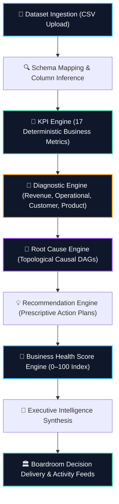

# 🧠 DecisionOS

> **Explainable AI Decision Intelligence Platform**  
> *DecisionOS transforms raw business datasets into deterministic KPIs, anomaly diagnostics, root cause causal graphs, prescriptive recommendations, and executive decision briefings.*

---

<p align="center">
  
  
  
  
  
  
  
  
  
</p>

---

## 📊 Platform Scale Snapshot

```
• 100+ Documented REST API Endpoints
• 40+ Normalized SQLAlchemy 2.0 Database Models
• 80+ Validated Pydantic v2 Domain Schemas
• 901 Automated Pytest Tests (100% Pass Rate across Unit, Integration & Edge Cases)
• 17 Deterministic Business KPIs (Revenue, AOV, Churn, Lead Times, Retention, etc.)
• 4 Diagnostic Domains (Revenue, Operational, Customer, Product)
• Topological Causal DAG Root Cause Analysis Engine
• Prescriptive Recommendation Engine with Distress Invariants
• 0–100 Explainable Business Health Scoring System
• Multi-Tenant SaaS Architecture with Strict Organization Scoping & RBAC
• Full-Stack Architecture: React 19 + TypeScript + FastAPI + PostgreSQL
```

---

## 🌐 Quick Access & Deployment Status

| Resource | Status | Access Details |
| :--- | :--- | :--- |
| **Enterprise Web UI** | Local Demonstration Available | React 19 + TypeScript (`http://localhost:3000`) |
| **Backend API** | Local Demonstration Available | FastAPI server (`http://127.0.0.1:8000`) |
| **API Documentation** | Live Interactive Swagger UI | OpenAPI 3.1 schema & request runner (`http://127.0.0.1:8000/docs`) |
| **Database** | PostgreSQL 16 / SQLite buffer | Managed with Alembic migrations |
| **Pre-Loaded Datasets** | In-App 1-Click Load | `DecisionOS Audit Dataset`, `DecisionOS SaaS Demo Dataset` |

---

## 💡 The Business Problem: Why This Project Matters

Most enterprise dashboards (Tableau, PowerBI, Metabase) report **what** happened:
- *"Revenue is down 14%."*
- *"Order cancellation rate is 23.7%."*
- *"Customer churn is rising."*

They stop at displaying numbers, leaving teams to guess the underlying causes.

**DecisionOS transforms passive reporting into decision intelligence by answering:**
1. **Why it happened**: Identifies specific metric anomalies against statistical baselines.
2. **What caused it**: Traces causal drivers using Directed Acyclic Graphs (DAGs).
3. **What actions to take**: Generates prioritized, prescriptive recommendations with effort vs. impact scoring.
4. **What business impact is expected**: Computes an explainable 0–100 Business Health Score and executive narrative.

---

## ⚡ Why DecisionOS is Different

| Dimension | Traditional BI Dashboards | Generic "AI Wrappers" | **DecisionOS Decision Intelligence** |
| :--- | :--- | :--- | :--- |
| **Calculus Layer** | Passive charts & manual formulas | Unchecked LLM prompt guesses | **17 Deterministic Business KPIs calculated in Python/SQL** |
| **Anomaly Detection** | Manual chart inspection | Naive text sentiment | **8-Stage Diagnostic Scanner with 4 Severity Tiers** |
| **Root Cause Analysis**| User guesswork | Superficial text summaries | **Topological Causal DAG with empirical trend correlation** |
| **Recommendations** | Manual slide writing | Generic uncalibrated advice | **Prescriptive action plans with effort/impact & distress rules** |
| **Data Integrity** | Prone to human spreadsheet errors | High risk of hallucinated metrics | **100% deterministic, auditable, and reproducible** |

---

## 🏛️ System Architecture

### 1. Software Layer Architecture
```
┌─────────────────────────────────────────────────────────────┐
│          Presentation Layer (React 19 + TypeScript)         │
│          • Enterprise Command Center   • Data Hub           │
│          • Root Cause Explorer         • Boardroom Studio   │
│          • Diagnostics Workspace       • Recommendations    │
└──────────────────────────────┬──────────────────────────────┘
                               ▼ (REST API / Bearer JWT)
┌─────────────────────────────────────────────────────────────┐
│             API Gateway & Security Layer (FastAPI)          │
│          • JWT Authentication          • RBAC Scoping       │
│          • Request Validation (Pydantic v2)                 │
└──────────────────────────────┬──────────────────────────────┘
                               ▼
┌─────────────────────────────────────────────────────────────┐
│                    Business Services Layer                  │
│          • KPI Engine                  • Diagnostic Engine  │
│          • Root Cause Engine           • Recommendation Svc │
│          • Health Score Engine         • Narrative Builder  │
└──────────────────────────────┬──────────────────────────────┘
                               ▼
┌─────────────────────────────────────────────────────────────┐
│                    Repository & ORM Layer                   │
│          • Diagnostic Repository       • RCA Repository     │
│          • Recommendation Repo         • Metric Repository  │
│          • SQLAlchemy 2.0 Async/Sync Sessions               │
└──────────────────────────────┬──────────────────────────────┘
                               ▼
┌─────────────────────────────────────────────────────────────┐
│               Database Layer (PostgreSQL 16)                │
│          • 40+ Normalized Tables       • Alembic Migrations │
└─────────────────────────────────────────────────────────────┘
```

### 2. Analytics Transformation Pipeline
```
Dataset Upload (CSV)
        ↓
Schema Mapping & Column Type Inference
        ↓
KPI Engine (17 Deterministic Metrics)
        ↓
Diagnostics Engine (4 Business Domains & Severity Tiers)
        ↓
Root Cause Engine (Topological Causal DAG Synthesis)
        ↓
Recommendation Engine (Prescriptive Action Plans)
        ↓
Business Health Score Engine (0–100 Explainable Index)
        ↓
Executive Intelligence Layer & Boardroom Command Center
```



<p align="center">
  
</p>

---

## 🖼️ UI Screenshots Showcase

### 1. Executive Decision Intelligence Command Center

*Executive dashboard displaying live active dataset telemetry, 0–100 Business Health Score, primary anomalies, root causes, and top prescribed actions.*

---

### 2. Diagnostics & Root Cause Analysis (Causal DAG)

*Automated causal graph linking operational drivers (e.g. Excessive Delivery Lead Times) directly to business outcomes (Order Cancellations).*

---

### 3. Recommendations Engine

*Prioritized action plans with estimated business impact, required effort, time-to-value ratings, and step-by-step execution guides.*

---

### 4. Knowledge Graph Explorer

*Entity relationship graph connecting business metrics, diagnostic anomalies, causal edges, and organizational owners.*

---

### 5. Executive Reports & Boardroom Studio

*Presentation workspace with automated executive summaries, strategic trade-off analyses, and exportable briefing cards.*

---

## ⚡ Current Platform Capabilities (Implemented & Verified)

```
✅ Deterministic KPI Engine: 17 core metrics calculated across Revenue, Operations, Customer, and Product.
✅ Multi-Domain Diagnostic Engine: 4 business domains with 4-tier severity escalation (LOW, MEDIUM, HIGH, CRITICAL).
✅ Topological Causal DAG Engine: Pure Python acyclic graph discovery using domain rule registries and correlation.
✅ Prescriptive Recommendation Engine: Contextual action plans with impact/effort scoring and distress fallbacks.
✅ Business Health Score Engine: Transparent 0–100 composite index with granular deduction breakdown payloads.
✅ Executive Briefing & Narrative Layer: Automated board-level briefing generation and live activity telemetry.
✅ Enterprise Command Center & Data Hub: In-place CSV ingestion, schema auto-mapping, and soft-deletion.
✅ Multi-Tenant SaaS Security: Strict organization scoping, JWT authentication, and Role-Based Access Control (RBAC).
✅ Testing & Verification: 901 automated tests in Pytest maintaining a 100% pass rate.
```

---

## 🔬 Core Engines Deep-Dive

### 1. KPI Calculus Engine (`kpi_engine.py`)
- **Purpose**: Computes 17 canonical business metrics directly from transactional records without approximations.
- **Computed Metrics**: Total Revenue, Average Order Value (AOV), Orders Volume, Active Customer Count, Churn Rate, Retention Rate, Cancellation Rate, Average Delivery Lead Time, Fulfillment Rate, Net Review Score, Product Concentration, etc.

### 2. Diagnostic Engine (`diagnostic_engine.py`)
- **Purpose**: Scans calculated KPIs against dynamic historical distributions and industry standards.
- **Severity Classification**:
  - `LOW`: Minor deviations from target SLA ($< 1.0\times$).
  - `MEDIUM`: Moderate performance drag requiring operational notice ($1.0\times - 2.0\times$).
  - `HIGH`: Significant business impairment ($2.0\times - 3.0\times$).
  - `CRITICAL`: Severe distress (e.g. Delivery $> 10\text{d}$, Cancellations $\ge 50\%$, Review Score $\le 2.0$).
  - **Catastrophic Multipliers**: Extreme collapse (e.g. 100% cancellation rate or $> 15\text{d}$ delivery) applies up to $1.5\times$ penalty escalation.

### 3. Root Cause Engine (`root_cause_engine.py`)
- **Purpose**: Evaluates candidate finding pairs $(A, B)$ using enterprise causal rules and empirical trend correlations.
- **Causal Graph (DAG)**: Constructs strictly acyclic graphs with topological ordering to isolate primary drivers from downstream symptoms.

### 4. Recommendation Engine (`recommendation_engine.py`)
- **Purpose**: Synthesizes prioritized, contextual business initiatives mapped directly to isolated root causes.
- **Distress Invariant**: If an organization's Health Score falls into `WATCH_LIST` ($\le 60$) or `CRITICAL` territory, the engine synthesizes an Emergency Business Recovery Program even if secondary findings are sparse.

### 5. Business Health Score Engine (`health_score.py`)
- **Purpose**: Computes a transparent, reproducible 0–100 index representing overall operational health.
- **Mathematical Formula**:
  $$\text{Score} = \text{round}\Big(\max\big(0, \min(100, 100 - \text{finding\_penalties} - \text{systemic\_penalty} - \text{rca\_penalties} + \text{recovery\_bonus})\big)\Big)$$
  - **Finding Penalties**: `LOW` = $-2$, `MEDIUM` = $-5$, `HIGH` = $-10$, `CRITICAL` = $-18$ (capped at 70).
  - **Systemic Failure Penalty**: $-10$ applied if $\ge 3$ critical findings exist simultaneously.
  - **RCA Penalty**: Up to $-8$ for high-impact primary causal drivers ($\ge 0.80$).
  - **Recovery Bonus**: Up to $+6$ for actionable mitigation plans and quick-win initiatives.

---

## 📈 Real API Example Response

Here is an actual JSON payload returned by `GET /api/v1/datasets/{id}/intelligence-report` for the verified **DecisionOS Audit Dataset**:

```json
{
  "dataset_id": "531bec5e-a77e-4219-876a-51f72885d850",
  "dataset_name": "Decisionos Audit Dataset",
  "artifact_counts": {
    "metrics": 17,
    "findings": 3,
    "root_causes": 1,
    "recommendations": 3
  },
  "executive_summary": {
    "business_health_score": 81,
    "business_health_status": "HEALTHY",
    "primary_issue": "High Order Cancellation Rate (23.7%)",
    "top_root_cause": "Excessive Delivery Lead Time (6.5 Days)",
    "top_recommendation": "Initiative: Optimize Order Cancellation Rate (23.7%)",
    "health_score_explanation": {
      "base_score": 100,
      "finding_deduction": 15,
      "rca_deduction": 8,
      "recovery_bonus": 4,
      "final_score": 81
    }
  },
  "root_causes": [
    {
      "relationship_type": "CAUSES",
      "relationship_strength": "VERY_STRONG",
      "confidence_score": 0.89,
      "impact_score": 0.90,
      "explanation": "Primary Issue: 'High Order Cancellation Rate (23.7%)' is driven by 'Excessive Delivery Lead Time (6.5 Days)'. Fulfillment transit bottlenecks and delivery delays directly drive order cancellation spikes."
    }
  ]
}
```

---

## 🧩 Engineering Challenges Solved

1. **Deterministic Root-Cause Analysis (Acyclic DAG Synthesis)**:
   - Constructed a custom pure-Python causal graph synthesizer with cycle prevention and topological ordering, guaranteeing acyclic dependencies ($A \to B \to C$) and preventing infinite circular attribution loops.

2. **Explainable Multi-Tier Health Scoring**:
   - Engineered a 0–100 composite scoring model that returns mathematical deduction breakdowns alongside the final number, resolving the "black-box" issue common in enterprise BI tools.

3. **Multi-Tenant Relational Isolation**:
   - Enforced strict tenant-scoped data isolation across all 40+ database models using SQLAlchemy query filters and FastAPI dependency injection.

4. **Dynamic Schema Mapping & Type Inference**:
   - Implemented automated column name normalization, alias matching, and data type inference to ingest messy transactional CSVs without manual configuration.

5. **Recommendation Prioritization & Distress Invariants**:
   - Formulated an algorithmic effort-vs-impact prioritization matrix with invariant safety checks ensuring organizations in distress (`CRITICAL` or `WATCH_LIST`) always receive structured recovery programs.

6. **Zero-Hallucination Explainable AI (XAI)**:
   - Enforced architectural separation where numerical computations are 100% deterministic code, and AI is leveraged solely to translate verified facts into executive briefings.

---

## 🛠️ Technical Architecture

```
Frontend
├─ React 19
├─ TypeScript 5.x
├─ Vite 8
├─ TanStack React Query v5
├─ React Router v7
└─ Vanilla CSS Design System & Lucide Icons

Backend
├─ FastAPI (Python 3.11+)
├─ SQLAlchemy 2.0 (Async/Sync sessions)
├─ PostgreSQL 16
├─ Alembic Migrations
├─ Pydantic v2
└─ Pandas & NumPy

Analytics & Intelligence Engines
├─ KPI Engine (17 Deterministic Business Metrics)
├─ Diagnostics Engine (4 Business Domains)
├─ Root Cause Engine (Topological Causal DAG)
├─ Recommendation Engine (Prescriptive Action Plans)
└─ Business Health Score Engine (0–100 Explainable Deductions)

Security & Governance
├─ JWT Authentication & Session Management
├─ Role-Based Access Control (RBAC)
└─ Multi-Tenant Row-Level Data Isolation
```

---

## 🔌 API Overview

DecisionOS provides a clean, documented REST API under `/api/v1/*`:

| Method | Endpoint | Description |
| :--- | :--- | :--- |
| `POST` | `/api/v1/auth/login` | Authenticate user and issue JWT token |
| `GET` | `/api/v1/datasets` | List registered datasets scoped by organization |
| `POST` | `/api/v1/datasets/upload` | Ingest CSV file and run automated calculus |
| `DELETE`| `/api/v1/datasets/{id}` | Soft-delete dataset from active context |
| `GET` | `/api/v1/datasets/{id}/intelligence-report` | Retrieve canonical unified intelligence report |
| `GET` | `/api/v1/datasets/{id}/health-score` | Retrieve 0–100 Health Score & arithmetic breakdown |
| `GET` | `/api/v1/datasets/{id}/diagnostics` | List categorized diagnostic findings |
| `GET` | `/api/v1/datasets/{id}/root-causes` | Retrieve causal DAG and isolated drivers |
| `GET` | `/api/v1/datasets/{id}/recommendations` | Retrieve prioritized prescriptive action plans |

---

## 🧪 Testing Strategy

The repository includes a comprehensive test suite executed with Pytest:

```bash
# Run test suite from backend directory
pytest -v
```

- **Unit Tests**: Mathematical correctness of all 17 KPI formulas, diagnostic threshold boundaries, and health score deduction equations.
- **Integration Tests**: End-to-end API pipeline from CSV upload to intelligence report generation.
- **Causal DAG Verification**: Topological sorting, cycle detection, and correlation threshold validation.
- **Security & Isolation Tests**: Cross-tenant data leak prevention, unauthorized role rejection, and token expiration.
- **Total Tests**: **901 Automated Tests (100% Pass Rate)**.

---

## 🚀 Quickstart & Local Setup

### Prerequisites
- **Python 3.11+**
- **Node.js 18+ & npm 9+**
- **PostgreSQL 16** (or local SQLite buffer)

### 1. Backend Setup
```bash
# Clone the repository
git clone https://github.com/Aaditgupta1234/DecisionOS.git
cd DecisionOS/backend

# Create and activate virtual environment
python -m venv venv
# On Windows:
.\venv\Scripts\activate
# On macOS/Linux:
source venv/bin/activate

# Install dependencies
pip install -r requirements.txt

# Run database migrations
alembic upgrade head

# Run full test suite (901 tests)
pytest

# Launch FastAPI backend server (http://127.0.0.1:8000)
uvicorn app.main:app --host 127.0.0.1 --port 8000 --reload
```

### 2. Frontend Setup
```bash
cd ../frontend

# Install dependencies
npm install

# Build verification
npm run build

# Launch Vite dev server (http://localhost:3000)
npm run dev
```

---

## 🗺️ Future Enterprise Roadmap

### 🚧 Upcoming Milestones
- **Phase 15.0 – Enterprise Workflow Automation**: Webhook-triggered data refreshes and automated alert notifications.
- **Phase 15.1 – Decision Copilot Grounding Layer**: Retrieval-Augmented Generation (RAG) verified against causal knowledge graphs.
- **Phase 15.2 – Digital Twin Scenario Expansion**: Multivariate Monte Carlo forecasting and shock simulation workspaces.
- **Phase 15.3 – Executive Report Automation**: Automated PDF and presentation slide generation.

---

## 💼 Skills Demonstrated

DecisionOS demonstrates end-to-end technical execution across core software engineering domains:

- **Backend Engineering**: Asynchronous FastAPI service-repository architecture, SQLAlchemy 2.0, Alembic migrations.
- **Analytics Engineering**: 17-metric deterministic KPI calculations with statistical volatility and trend analysis.
- **Explainable AI (XAI)**: Architected to prevent LLM hallucinations by enforcing strict separation between deterministic calculus and natural language generation.
- **Causal Graph Discovery**: Pure Python topological Directed Acyclic Graph (DAG) construction with empirical correlation filtering.
- **SaaS Architecture**: Strict multi-tenant isolation, Role-Based Access Control (RBAC), and JWT authentication.
- **Testing & Quality Assurance**: **901 automated tests** maintaining a 100% pass rate across unit, integration, and regression suites.

---

## 📄 License & Attribution

This project is licensed under the MIT License.  
**Created and engineered by Aadit Gupta.**
