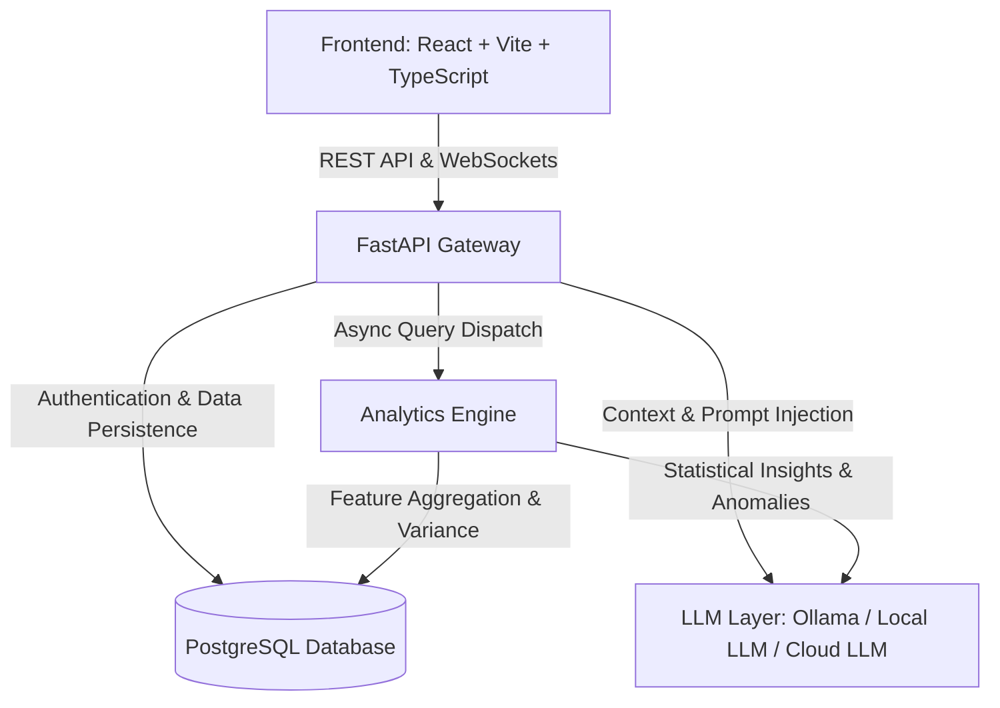

# DecisionOS Architecture Specification

DecisionOS is an Explainable AI Business Diagnosis Platform designed to empower executives, business analysts, and decision-makers with automated metric decomposition, root-cause identification, and conversational intelligence.

---

## High-Level System Architecture

---

## Architecture Components

### 1. Frontend Layer (`frontend/`)
- **Technology**: React 18, TypeScript, Vite, Tailwind CSS / Vanilla CSS.
- **Responsibilities**:
  - Interactive Business Dashboard & Executive Overview.
  - Dynamic KPI Tree Visualizations & Waterfall Charts.
  - File Upload Portal (CSV, Excel, Parquet).
  - Business Chat Interface with Streaming LLM Responses.

### 2. FastAPI Gateway (`backend/app/`)
- **Technology**: Python 3.10+, FastAPI, Pydantic v2, Uvicorn.
- **Responsibilities**:
  - Modular API Routing (`/api/v1`).
  - Request Validation & Standardized Response Wrapping.
  - Dependency Injection (Session, Security, Auth, RBAC).
  - Lifespan & Environment Configuration Management.

### 3. Analytics Engine (`backend/app/analytics/`)
- **Technology**: Pandas, NumPy, SciPy, Polars / DuckDB.
- **Responsibilities**:
  - **KPI Decomposition Engine**: Automatically breaks top-line metrics (e.g. Revenue) into drivers (e.g. Volume * Price).
  - **Variance Analysis**: Calculates Period-over-Period (PoP) and Year-over-Year (YoY) variances.
  - **Contribution Analysis**: Determines percentage contribution of sub-factors to revenue drops or margin shrink.
  - **Anomaly Detection**: Identifies statistical outliers in time series business metrics.

### 4. Database Layer (`backend/app/database/` & `backend/app/models/`)
- **Technology**: PostgreSQL, SQLAlchemy 2.0 ORM, Alembic migrations.
- **Responsibilities**:
  - User Authentication, Roles & Permissions (RBAC).
  - Multi-tenant Organization & Dataset Metadata.
  - Saved KPI Formulas & Metric Definitions.
  - Audit Trail & Generated Report Snapshots.

### 5. LLM Layer (`backend/app/services/` - AI Service)
- **Technology**: Ollama (Local Llama 3 / Mistral) or Open-weights Models.
- **Responsibilities**:
  - Natural Language to SQL/Analytics Query translation.
  - Generating executive executive summaries & actionable recommendations.
  - Interactive Business Assistant ("Why did profit decline in Q3?").
  - Guardrails & Context Verification to eliminate hallucinations.
